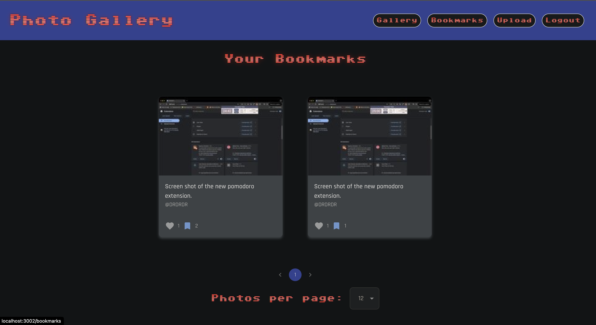

# 🕹️ Retro Photo Gallery 📸

Welcome to Retro Photo Gallery, the ultimate photo sharing experience with an 80's twist! Get ready to level up your photo game and embark on a nostalgic journey through pixels and power-ups!

## 🌟 Features

### 📸 Upload Your Perfect Shots
Capture the world in all its glory! Upload your photos and watch them transform into art masterpieces.

### ❤️ Like System
Show some love to your favorite pics! Hit that like button and watch the hearts fill up like a health bar.

### 🔖 Bookmark Your Favorites
Save the best for later! Bookmark photos to create your personal high-score collection.

### ✏️ Edit Your Bookmarks
Made a mistake? No game over here! Edit your bookmarks anytime to keep your collection pixel-perfect.

### 🏷️ Category Tags
Organize your photos with power-up inspired tags! From "Space Invaders" to "Dragon's Lair", categorize your pics for easy leveling up.

### 🔍 Search Function
Use our cheat-code-like search to find the exact photo you're looking for! Filter by tags to discover new favorites.

## 🎮 Getting Started

1. Clone the repository:
   \`\`\`
   git clone https://github.com:DanRoss88/Photo-Gallery.git
   \`\`\`

2. Install dependencies:
   \`\`\`
   cd photo-gallery
   npm install
   \`\`\`

3. Start the game... err, app:
   \`\`\`
   npm start
   \`\`\`

4. Open your browser and navigate to \`http://localhost:3000\`

5. Start uploading, liking, and bookmarking your way to photo gallery greatness!

## 🕹️ How to Play

1. **Upload**: Click the "Upload" button to add your photos to the gallery.
2. **Like**: Hit the heart icon to like a photo. Watch your likes stack up!
3. **Bookmark**: Click the bookmark icon to save photos to your personal collection.
4. **Edit Photos**: Navigate to your profile to manage and edit your photos.
5. **Search**: Use the search bar and category tags to find specific photos or themes.

## Features
Here are some features of my project:

*Screenshot of the home page.*

*Screenshot of the bottom of the home page.*

*Screenshot of the bookmark page.*

*Screenshot of the upload page.*

## 📜 License

This project is licensed under the MIT License.

## 🎉 Acknowledgments

- Inspired by classic 80's video games and the golden age of arcades
- Built with love by *Daniel Ross*

Ready Player One? Let's dive into the Retro Pixel Gallery and start your photo adventure! 🚀👾
    `}</Markdown>
  );
}
